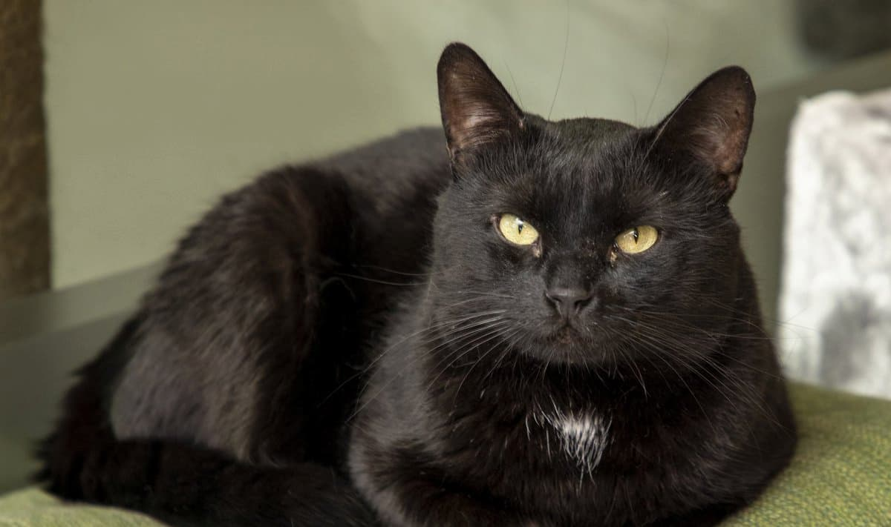
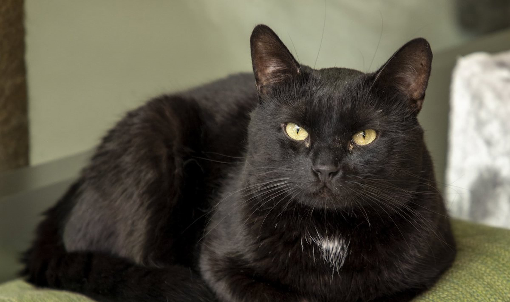
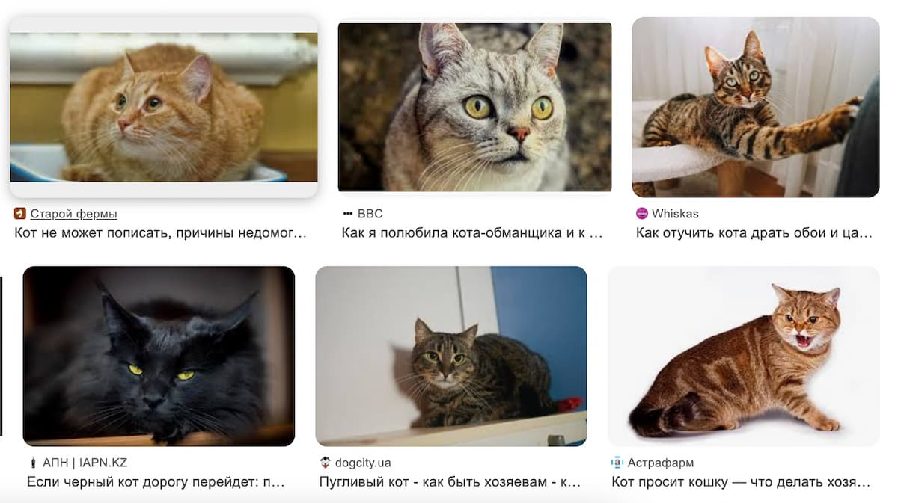
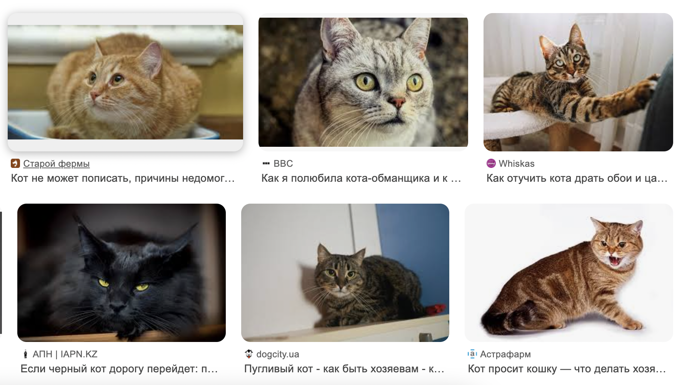
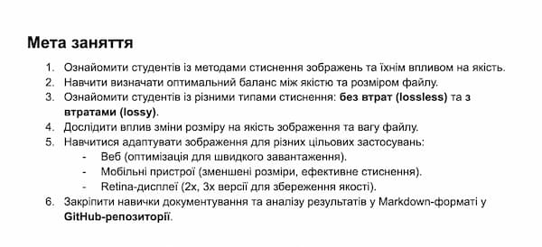
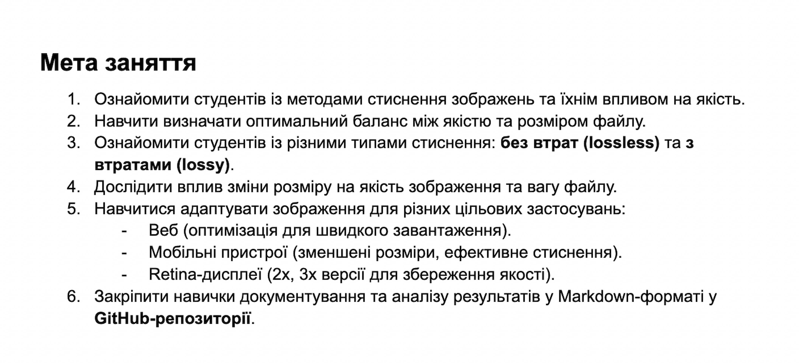

### original cat.jpg

### cat-mob_600.jpg

### cat-web_1200.jpg

### cat-retina_3x.jpg

### cat-mozjpeg.jpg

### cat.webp

### cat-screenshot-mob_600.jpg

### cat-screenshot-mozjpeg.jpg

### cat-screenshot-retina_3x.jpg

### cat-screenshot-web_1200.jpg

### cat-screenshot.png

### cat-screenshot.webp

### text-screenshot-mob_600.jpg

### text-screenshot-mozjpeg.jpg

### text-screenshot-retina_3x.jpg

### text-screenshot-web_1200.jpg

### text-screenshot.png

### text-screenshot.webp

<table>
  <tr>
    <th>Зображення</th>
    <th>Початковий розмір</th>
    <th>WEBp</th>
    <th>MozJPEG</th>
    <th>1200 px</th>
    <th>600 px</th>
    <th>3x</th>
  </tr>
  <tr>
    <td><strong>Фото (JPG)</strong></td>
    <td>94 371 Б (98 КБ)</td>
    <td>38 116 Б (41 КБ)</td>
    <td>52 203 Б (53 КБ)</td>
    <td>53 114 Б (53 КБ)</td>
    <td>17 122 Б (20 КБ)</td>
    <td>243 852 Б (246 КБ)</td>
  </tr>
  <tr>
    <td><strong>Скріншот (PNG)</strong></td>
    <td>2 207 598 Б (2,2 МБ)</td>
    <td>86 658 Б (90 КБ)</td>
    <td>133 146 Б (135 КБ)</td>
    <td>78 133 Б (82 КБ)</td>
    <td>27 636 Б (29 КБ)</td>
    <td>557 019 Б (557 КБ)</td>
  </tr>
  <tr>
    <td><strong>Скріншот з текстом (PNG)</strong></td>
    <td>400 653 Б (401 КБ)</td>
    <td>63 118 Б (66 КБ)</td>
    <td>69 898 Б (74 КБ)</td>
    <td>54 745 Б (57 КБ)</td>
    <td>22 262 Б (25 КБ)</td>
    <td>294 234 Б (295 КБ)</td>
  </tr>
</table>

## Висновки

### 1. Який формат найкраще підходить для кожного типу зображень?
- **Фотографії**: Найкраще використовувати формати стиснення з втратою якості (lossy), такі як MozJPEG або WebP (lossy), оскільки вони забезпечують значне зменшення ваги без значної втрати якості. Формат AVIF також є хорошим вибором для фотографій, оскільки має високу ступінь стиснення при збереженні якості.
- **Скріншоти**: Для скріншотів оптимальними форматами є PNG (lossless) або WebP (lossless), оскільки вони зберігають всі деталі зображення без втрати якості.
- **Графічні зображення з текстом**: Для таких зображень, де важлива чіткість тексту, рекомендовано використовувати PNG (lossless) або WebP (lossless), оскільки ці формати забезпечують високу якість без втрати текстових елементів.

### 2. Як зміна розміру впливає на оптимізацію?
Зменшення розміру зображення для різних цільових застосувань дозволяє значно зменшити його вагу, що позитивно впливає на швидкість завантаження сторінок. Проте, важливо знайти оптимальний баланс, оскільки занадто велике зменшення розміру може призвести до втрати чіткості та деталізації зображення, що погіршує користувацький досвід, особливо на Retina-дисплеях.

### 3. Як правильно адаптувати зображення для Retina-дисплеїв?
Для адаптації зображень для Retina-дисплеїв слід створювати версії зображень з розширенням 2x або 3x. Це дозволяє зберегти чіткість та деталізацію зображення при відображенні на дисплеях з високою щільністю пікселів. У веб-розробці можна використовувати атрибут `srcset` для завантаження відповідних версій зображень залежно від роздільної здатності екрану.
